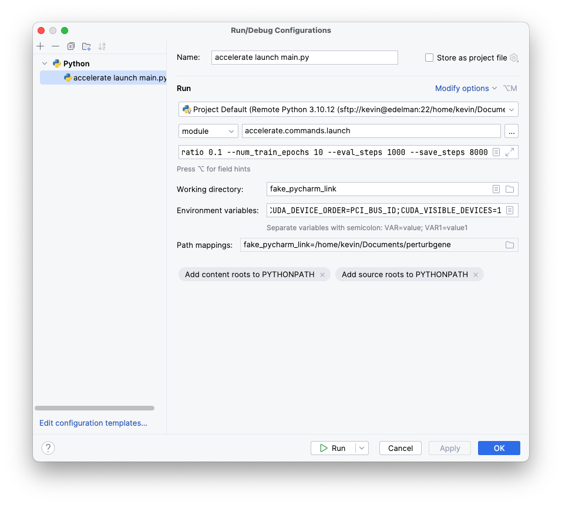

# Transformerics

In this code base, we use a novel method to encode gene expression data
that takes into account all the highly variable genes in a dataset. We fix the order
of the genes for all the cells in the dataset from the most variable to the least variable
(however, this is just an easy convention to follow and it is not necessary). Each gene
is determined by its position in the input_ids. 

There are three different settings for the encoding method:

1. we use a threshold to form a binary representation of the gene expression data.
In this case, the genes are either expressed or not expressed. This is the simplest 
yet the most fundamental way to encode the gene expression data. It captures the most essential interactions between genes.
The vocabulary in this case is 0 and 1 for each gene plus the special tokens (that will be discussed later).
2. we use a binning method to form a continuous representation of the gene expression data. This 
introduces more fine-grained representations of the gene expression data. The vocabulary in this case is the number of bins for each gene plus the special tokens.

We also concatenate to the input some special tokens as follows:

1. [CLS] which is a special token that is used for classification tasks. This token is used to get the hidden state of the entire sequence.
2. [SEX_TYPE_TOKEN] which can get values of [NO_SEX] (not specified), [female], [male]
3. [TISSUE_TYPE_TOKEN] which can get values of [NO_TISSUE] or the name of the tissue.
4. [CELL_TYPE_TOKEN] which can get values of [NO_CELL_TYPE] or the name of the cell type.
5. [AGE_TYPE_TOKEN] which can get values of [NO_AGE] or the age of the individual.
6. [DISEASE_TYPE_TOKEN] which can get values of [NO_DISEASE] or the name of the disease.

Finally, the input to the model has the following format:

```
[CLS] [SEX_TYPE_TOKEN] [TISSUE_TYPE_TOKEN] [CELL_TYPE_TOKEN] [AGE_TYPE_TOKEN] [DISEASE_TYPE_TOKEN] [START] gene1 gene2 gene3 ... geneN [END]
```

These sequence type tokens helps with the tasks of denoising (masked language modeling) and classification
Also, they can be used as control tokens to create samples with different characteristics especially when the dataset is imbalanced or low samples for some characteristics.
This approach has been fruitful in some models like T5 that uses control codes to generate samples with different characteristics.


## The model
We use BERT as the base model for our encoding. BERT is a denoising model that is trained to predict the masked tokens in a sequence. 
We use BERT to find out the complex interactions between genes using the task of denoising. For each sample in the dataset
we mask some of the genes and we train the model to predict the masked genes. This way, the model learns the interactions between genes.
This method goes beyond traditional methods that rely only on the coarse grained statistical properties of the genes such as the mean, variance, and the correlation between genes.

## Loss function
For the case of binary encoding, we use the binary cross-entropy loss function. For the case of binning
we use cross entropy loss function with label smoothing. We use label smoothing to prevent the model from being too confident about its predictions.
This is especially important because the bins have a natural order (ordinal data) and 
while training the model should look at other bins too.

The other loss function uses a gaussian smoothing in which the logits that are closer to the target are penalized less than the logits that are far from the target.

## Inference
For models that are trained on all phenotypes the samples should be taken
from a large dataset that contains all phenotypes that are not present in the `filter_phenotypes` keys
for models that are trained on one phenotype we have to set the value for
other phenotypes to no_phenotype such as `no_sex`, `no_age`, `no_disease`, `no_tissue`, `no_cell_type`


## Installation
Install gcc and g++:

```bash
sudo apt-get install gcc g++
```

Install nano

```bash
sudo apt-get install nano
```


The `max_length` should always be bigger than `n_highly_variable_genes` by two, in other words, max_length = n_highly_variable_genes + 2

## Usage

### Not PyCharm (e.g. `accelerate launch` from shell)
Uncomment `MODE = ""` in `main.py`.

### PyCharm
Go to Run/Debug Configurations. 
Change it to resemble 

My Script parameters are: ```--mixed_precision=fp16 --num_processes=1 --num_machines 1 --dynamo_backend no main.py --bin_edges 0.1 --pretrained_model_path perturbgene/model_configs/distilbert_base.json --shard_size 10000 --eval_data_paths /home/shared_folder/TabulaSapiens/ranked/Tabula_Sapiens_ranked_47.h5ad --max_length 1024 --num_top_genes 58604 --vocab_path perturbgene/data/phenotypic_tokens_map.json --included_phenotypes cell_type sex tissue --use_flash_attn --per_device_eval_batch_size 256 --dataloader_num_workers 4 --output_dir output_v10_base_gene000 mlm --gene_mask_prob 0.00 --phenotype_mask_prob 0.5 --train_data_paths /home/shared_folder/TabulaSapiens/ranked/Tabula_Sapiens_ranked_{0..43}.h5ad --num_hidden_layers 12 --num_attention_heads 12 --per_device_train_batch_size 128 --learning_rate 1e-4 --weight_decay 5e-2 --warmup_ratio 0.1 --num_train_epochs 10 --eval_steps 1000 --save_steps 8000```

My Environment variables are: ```PYTHONUNBUFFERED=1;CUDA_DEVICE_ORDER=PCI_BUS_ID;CUDA_VISIBLE_DEVICES=1```

You should not need to worry about the Python Interpreter, Working directory, or Path mappings when running locally.